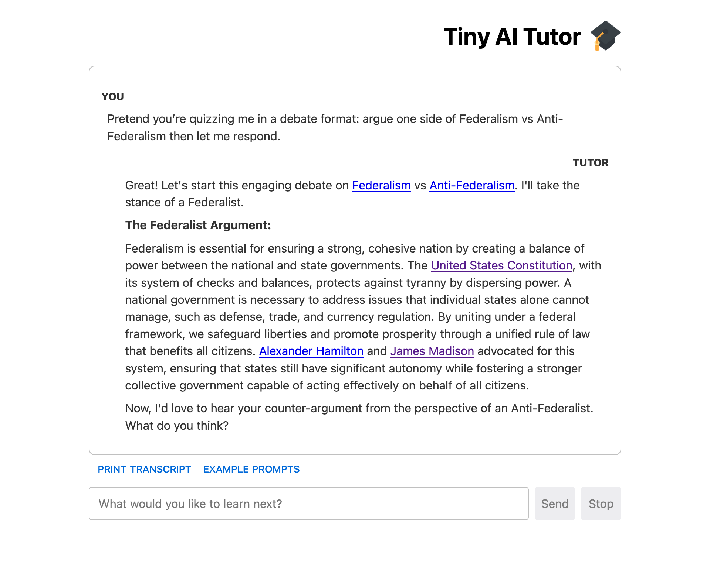
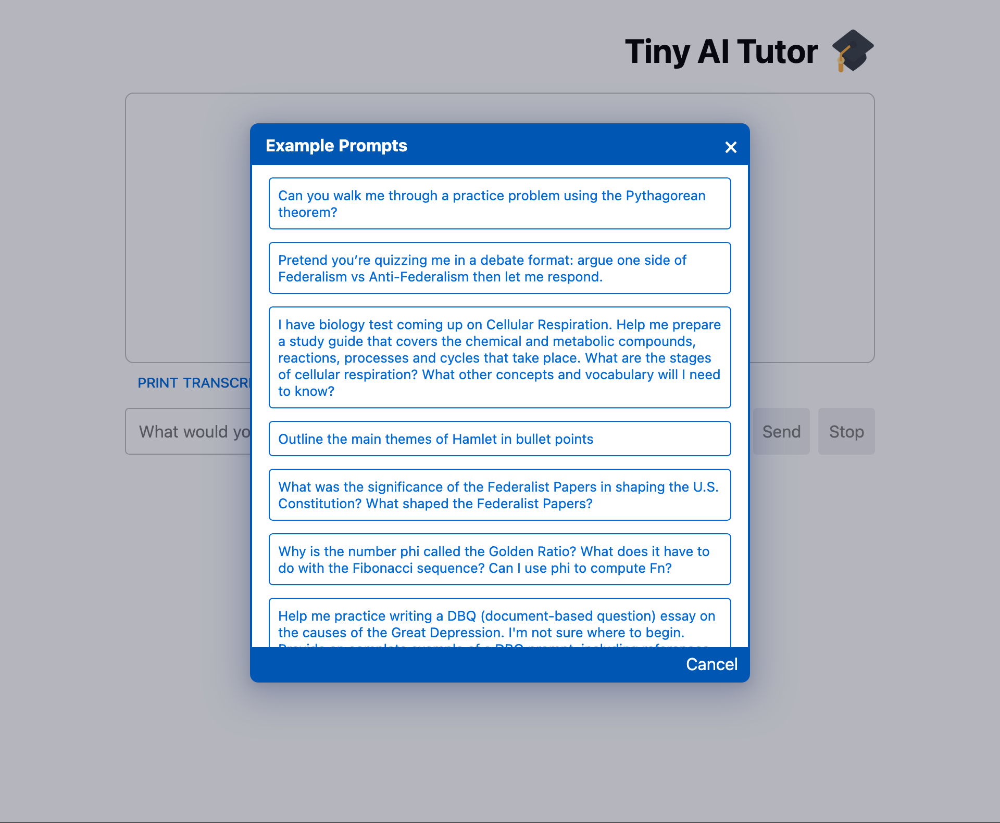

# Tiny AI Tutor

A small chat bot tutor, powered by generative AI.

Ask a question. Get a tailored response. Continue the conversation.



[(More screenshots below.)](#screenshots-and-examples)

If you need help getting started, a set of example prompts is provided for inspiration.

---

<p align="center">

[Quick Start](#quick-start) | [Features](#features) | [Screenshots](#screenshots-and-examples) | [Tech Stack](#tech-stack) | [Build Pipeline](#workflow-automation) | [Service Management](#workflow-automation) | [Configuration](#configuration)

</p>

---

## Quick Start

### Prerequisites

To install, build and run the application locally, you will need:

  1. **OpenAI API key:** You must provide your own API key. Sign up or retrieve one [here](https://platform.openai.com/account/api-keys).

  2. **Node.js:** Tested with node v22 and node v20 (the current and previous LTS releases, respectively, as of this writing) but any moderately recent version should work. (For help installing Node, see [instructions here](https://nodejs.org/en/download).)

  3. **Docker:** Tested with the v20 engine, but should be compatible with most modern versions of Docker. (If you need help installing Docker, instructions are [here](https://docs.docker.com/engine/install/).)
     * Technically Docker is not a _strict_ requirement. See the [manual build instructions](#manual-build-instructions) below for alternatives.

All other external dependencies will installed automatically.

### Launching

1. **Configure with OpenAI API key:**
   - Copy [.env.example](./.env.example) to .env: ```cp .env.example .env```
   - Edit this new .env file to set `OPENAI_KEY`. All other parameters are optional.

2. **Build and launch:**
   Run `make run` to install, build and launch the cluster of services.

3. **Open your browser:**
   Visit <http://localhost:8080> (or whatever value you set `HOST_PORT` to in your .env file) to access the site.

Notes:

  - **Ctrl+C to stop the service.** The command `make run` launches the service (as a docker-compose cluster) in the foreground. Hence you can use the standard "keyboard interrupt" to stop the running process.

  - If you don't want to use `make` (or Docker for that matter), see the [manual build instructions](#manual-build-instructions) for alternatives.

  - Rather than creating an .env file, you _may_ provide the `OPENAI_KEY` value as an environment variable instead. For example, you could skip step #1 and use `OPENAI_KEY=sk-… make run` in step #2 instead.

  - There's no harm in using `make run` (and subsequently `Ctrl+C`) every time you want to start (and subsequently stop) the service, but [](#build-and-workflow-automation)

#### Troubleshooting

If you encounter issues with `make run`, try:

  - `make clean install build run` to force the build sequence without relying on make's dependency resolution magic.

  - `make clean-more reinstall` (followed by any of the above) to invoke the "nuclear option" of wiping out all installed dependencies and lockfiles to force a full, fresh install.

If you're still having problems see the [manual build instructions](#manual-build-instructions).

#### Manual Build Instructions

If you don't want to use `make`, you can also build and run the services manually:

```bash
(cd client && npm install)
(cd server && npm install)
(docker compose up --build)
```

If you don't want to use `docker`, you also run the client and server directly on the host. See the `npm run […]` scripts provided in respective `package.json` files for details.

---

## Features

  * **Pedagogical Orientation** [^1]

    The tutor follows a collaborative, constructivist approach to learning that builds new understanding from prior knowledge, driven by the student's curiosity.

    Emphasizes:
    (a) clear and accessible language;
    (b) Socratic questioning rather than rote answer-giving;
    (c\) metacognitive coaching to help students notice and address gaps in their understanding; and
    (d) multiple representations and modes of interaction to support diverse learning styles.

  * **Authoritative Sourcing**

    The tutor draws from a curated collection of trusted educational, informational and reference sources (e.g., Britannica, The National Archives, Khan Academy) to connect students with primary sources, expert explanations, and alternative perspectives.

    Notable people, places, events, and concepts are hyperlinked to an authoritative reference source.

    Images and media are provided (inline or as links) when they meaningfully enhance understanding.

  * **Rich Formatting**

    Responses are rendered as "GitHub-flavored" Markdown (tables, task lists, code blocks, footnotes) extended with support for robust, LaTeX-style typesetting of mathematical equations, chemical formulas and other technical content. (See [here](./docs/screenshot-pythagorean-theorem-1920x2759.png) and [here](./docs/transcript-fibonacci.pdf) for example.)

  * **Engagement Scaffolding**

    Every response includes:
    (a) curated links for further reading on the topic or alternative presentations of the material; and
    (b) suggestions for follow-up activities, questions, and prompts to invite more in-depth exploration.

[^1]: To a limited extent: I have none of the relevant qualifications and can't claim any particular expertise in learning science. While there may be a "nod" in that general direction, pedagogical strategies are not the primary focus of the current version of this demonstration.

## Screenshots and Examples

**Screenshots**

<div style="display:flex;flex-wrap:wrap;gap:1rem;justify-content:space-evenly;align-items:flex-start;margin:0 1rem;">
  <a href="./docs/screenshot-chat-1920x1582.png" target="_blank"
     title="Screenshot: Simple question and response. (Click to open in a new window.)"
     style="max-width:min(25%,380px);">
    </figure>
  </a>
  <a href="./docs/screenshot-pythagorean-theorem-1920x2759.png" target="_blank"
     title="Screenshot: Longer response, with math. (Click to open in a new window.)"
     style="max-width:min(25%,380px);">
    
  </a>
  <a href="./docs/screenshot-pythagorean-theorem-1920x2759.png" target="_blank"
     title="Screenshot: Example prompts. (Click to open in a new window.)"
     style="max-width:min(25%,380px);">
    
  </a>
</div>

**Transcripts**

  * [Chat Transcript: Articles of Confederation](./docs/transcript-articles-of-confederation.pdf)
  * [Chat Transcript: Fibonacci Sequence and the Golden Ratio](./docs/transcript-fibonacci.pdf)
  * [Chat Transcript: DBQ on the Great Depression](./docs/transcript-great-depression-dbq.pdf)

The transcripts are (PDF-format) exports of longer conversations, generated using the "Print Transcript" action as seen in the screenshots above).

---

## Tech Stack

### Frontend

An HTML5 / CSS3 / ES6 (JavaScript) web UI built with:

  * [React](https://react.dev/)
  * [TypeScript](https://www.typescriptlang.org/)
  * [Vite](https://vitejs.dev/)

supported by:
  * [CSS Modules](https://github.com/css-modules/css-modules)
  * Markdown rendering via [Unified.js](https://unifiedjs.com/)
  * [KaTeX](https://katex.org/) (and [mhchem](https://mhchem.github.io/MathJax-mhchem/)) for LaTeX-style scientific typesetting

### Backend

An event-based, streaming API built with:

  * [Node.js](https://nodejs.org/)
  * [Express.js](https://expressjs.com/)
  * [TypeScript](https://www.typescriptlang.org/)

using:
  * [OpenAI's API "platform"](https://openai.com/api/)
  * [Server-Sent Events (SSE)](https://developer.mozilla.org/en-US/docs/Web/API/Server-sent_events/) - i.e. `Content-Type: text/event-stream`

### DevOps and Tooling

While the service _can_ be built and run with just npm and vite, this repo also includes more robust operational infrastructure, using:

  * [Docker](https://www.docker.com/) to containerize both the (client-side-code-hosting) web and (API-providing) app server applications for easy and standardized deployment.
  * [Docker Compose](https://docs.docker.com/compose/) for multi-container orchestration (i.e. to build, launch, manage and monitor the end-to-end application as if it were a single service).
  * [nginx](https://nginx.org/) to serve the client-side artifacts needed for the web UI over HTTP.
  * [envalid](https://github.com/af/envalid) for operator-friendly validation of run-time configuration parameters; [dotenv](https://github.com/motdotla/dotenv) to support configuration via an (optional) `.env` file in addition to conventional environment variables.
  * a [GNU Make](https://www.gnu.org/software/make/)-based `Makefile` to simplify and streamline the build/deploy pipeline and other forms of workflow automation.

## Workflow Automation

The [Makefile](./Makefile) includes a number of targets to support build pipeline automation and basic service management.

Use:

  * `make run` to launch the service in the foreground, as described in [Quick Start](#quick-start).

  * `make start` | `stop` | `restart` | `status` | `logs` for daemon-style service management.

  * `make build` to generate the deployment artifacts (docker images).

  * `make clean` to remove generated build files (or `make clean-more` to remove both generated and installed files).

  * `make help` for a menu of additional build targets (example [below](#make-help)).

All targets should trigger any necessary prerequisite actions by default.

Note that build targets may be combined, e.g., `make clean build` or `make restart logs`.

Also see [Troubleshooting](#troubleshooting) and [Manual Build Instructions](#manual-build-instructions).

### make help

Running `make help` (or just `make`) will generate the following help text:

```
Common Build Targets:

  help       show this help message
  help.all   list ALL build targets in this Makefile
  install    install 3rd-party dependencies
  build      generate docker images
  run        launch docker containers in foreground
  start      launch docker containers as a daemon
  stop       stop docker containers
  restart    stop then start
  status     check if docker containers are up
  logs       tail docker logs
  force      remove dummy files used for "manual" freshness checking
  clean      remove generated files

Quick Start:

  1. cp .env.example .env
  2. Edit .env to set OPENAI_KEY.
  3. Run make run to launch in the foreground
      or make start to launch as a daemon.
      Both targets will automatically
      install and build as needed.
  4. Visit http://localhost:8080
     (or the HOST_PORT set in .env).
```

## Configuration

Configuration parameters may be provided as environment variables or in an `.env` file in project root. (See [`.env.example`](./.env.example) for a template.)

`OPENAI_KEY` is the only required parameter.

| Variable        | Default  | Description                                  |
|-----------------|----------|----------------------------------------------|
| `OPENAI_KEY`    | (none)   | OpenAI API key (REQUIRED!)                   |
| `OPENAI_MODEL`  | `gpt-4o` | OpenAI model name                            |
| `SERVER_PORT`   | `3000`   | app server port (ignored in Docker)          |
| `HOST_PORT`     | `8080`   | web server port (only used in Docker)        |
| `NODE_DEBUG`    | (empty)  | Add `tiny-ai-tutor-server` for debug logging |
